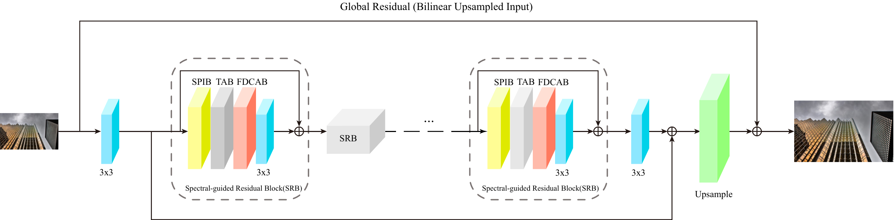
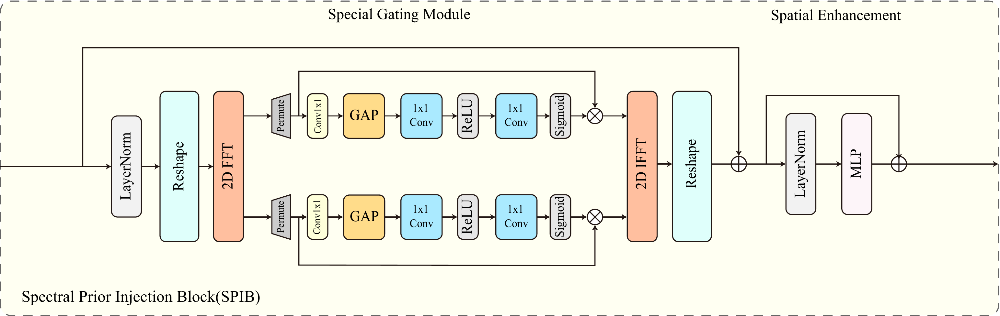
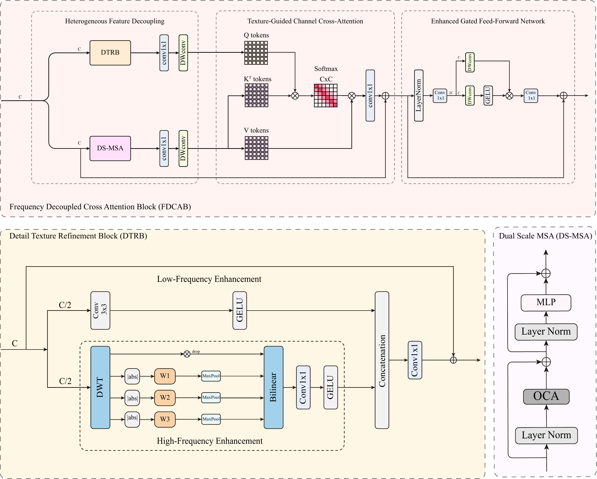
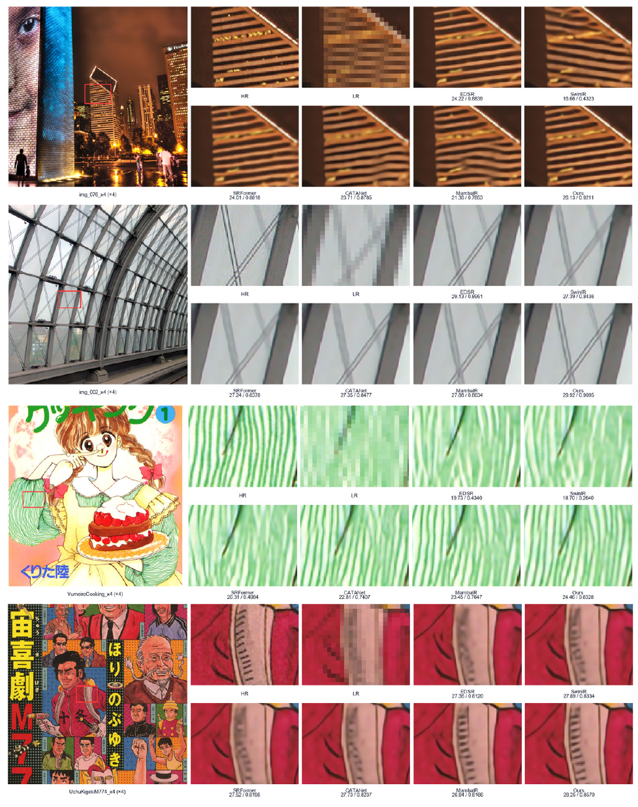

<h1 align="center">SPST-Net: Structure--Texture Decoupled Attention with Spectral Prior for Image Super-Resolution</h1>

<p align="center"><strong>Jia Zhu</strong></p>
<p align="center">Manuscript under review</p>

<p align="center">
  <a href="https://github.com/ThalynVeris/SPST-Net">Code</a> |
  <a href="https://github.com/ThalynVeris/SPST-Net/releases/tag/v0.1-review">Checkpoints</a> |
  <a href="results/">Visual Results</a>
</p>

## Brief Introduction

SPST-Net is a lightweight Transformer-based framework for single-image super-resolution (SISR). It is designed around two complementary restoration objectives: preserving reliable structural organization and recovering fine texture details. The network also introduces frequency-domain evidence to help constrain the inherently ambiguous reconstruction of high-frequency content lost during downsampling.

The framework contains four principal components:

- **Spectral Prior Injection Block (SPIB)** derives sample-adaptive spectral evidence from deep features and injects the inverse-transformed response into the spatial backbone. Its real and imaginary branches are parameterized independently as an implementation mechanism for complex-spectrum modulation; no separate image semantics are assigned to the two components.
- **Token Aggregation Block (TAB)** groups content-related tokens to provide auxiliary non-local context before structure--texture interaction.
- **Frequency-Decoupled Cross-Attention Block (FDCAB)** models structure- and texture-oriented representations in dedicated branches. Texture-derived queries interact with structure-derived keys and values, while the structure representation serves as the residual base.
- **Detail Texture Refinement Block (DTRB)** uses localized directional Haar-wavelet responses to support texture-oriented feature modeling.

## Method Overview

### Overall Architecture

<p align="center">
  
</p>

SPST-Net consists of shallow feature extraction, cascaded deep stages, and PixelShuffle-based image reconstruction. Each deep stage follows the sequence SPIB, TAB, FDCAB, convolution, and local residual connection. A final image-level residual connection adds the predicted high-resolution residual to the bilinearly upsampled input.

### Spectral Prior Injection Block

<p align="center">
  
</p>

SPIB applies a two-dimensional real FFT to deep spatial features, modulates the resulting complex spectrum with separately parameterized real and imaginary branches, and returns the response to the spatial domain through an inverse real FFT. This supplies complementary frequency-domain guidance for inferring high-frequency details without treating the real and imaginary coordinates as independent semantic components.

### Frequency-Decoupled Cross-Attention Block

<p align="center">
  
</p>

FDCAB coordinates structure and texture through asymmetric cross-attention. The texture-oriented DTRB branch produces the queries, whereas the structure-oriented DS-MSA branch supplies the keys, values, and residual anchor. Within DTRB, localized directional responses from the LH, HL, and HH Haar-wavelet subbands are aggregated for fine-detail modeling.

## Repository Structure

```text
SPST-Net-release/
|-- basicsr/
|   |-- archs/spst_net_arch.py       # SPST-Net and its core modules
|   `-- models/spst_net_model.py     # BasicSR model wrapper
|-- datasets/                        # Local dataset root (data are not distributed)
|-- figs/                            # README figures from the manuscript
|-- options/
|   |-- train/                       # x2, x3, and x4 training configurations
|   `-- test/                        # x2, x3, and x4 benchmark configurations
|-- pretrained_models/               # Local checkpoint destination
|-- results/                         # Released benchmark outputs
|-- requirements.txt
`-- setup.py
```

The architecture is registered as `SPSTNet`, and its BasicSR wrapper is registered as `SPSTNetModel`.

## Installation

The recorded experiments used BasicSR 1.4.2, PyTorch 2.2.2+cu118, and TorchVision 0.17.2+cu118. Install the dependencies and register the local BasicSR package with:

```bash
pip install -r requirements.txt
python setup.py develop
```

`basicsr/utils/options.py` currently imports DeepSpeed during option initialization, so the `deepspeed` dependency listed in `requirements.txt` is required even when `ENABLE_DEEPSPEED` is not enabled.

## Dataset Preparation

The configuration files expect DIV2K for training and Set5, Set14, B100, Urban100, and Manga109 for evaluation. Dataset files are not included in this repository. Arrange locally obtained datasets as follows:

```text
datasets/
|-- DIV2K/
|   |-- DIV2K_HR/
|   `-- DIV2K_LR_bicubic/
|       |-- x2/
|       |-- x3/
|       `-- x4/
`-- TestDataSR/
    |-- HR/
    |   `-- {Set5,Set14,B100,Urban100,Manga109}/{x2,x3,x4}/
    `-- LR/LRBI/
        `-- {Set5,Set14,B100,Urban100,Manga109}/{x2,x3,x4}/
```

The HR and LR images paired by `PairedImageDataset` must follow the filename templates specified in the corresponding YAML file.

## Training

The repository exposes the following BasicSR entry points:

```bash
# Train the x2 model from scratch
python basicsr/train.py -opt options/train/train_spst_net_x2.yml

# Scale-transfer configurations retained from the recorded experiments
python basicsr/train.py -opt options/train/train_spst_net_x3.yml
python basicsr/train.py -opt options/train/train_spst_net_x4.yml
```

The x3 and x4 configurations initialize from the x2 checkpoint with non-strict loading. The released checkpoints preserve a historical module hierarchy that differs from the current public class layout; see [Checkpoint Compatibility](#checkpoint-compatibility) before using these two configurations. No distributed-training shell wrapper is included.

## Testing

The benchmark entry points are:

```bash
python basicsr/test.py -opt options/test/test_spst_net_x2.yml
python basicsr/test.py -opt options/test/test_spst_net_x3.yml
python basicsr/test.py -opt options/test/test_spst_net_x4.yml
```

The test configurations evaluate PSNR and SSIM on the luminance channel of YCbCr, with scale-dependent border cropping. They use strict checkpoint loading. In the current review release, the checkpoint hierarchy mismatch described below must be resolved before these commands can be treated as turnkey evaluation commands.

## Inference on Custom LR Images

A standalone command-line inference script for arbitrary LR image folders is not included in the current review release. The repository contains `SingleImageDataset`, but it does not provide an `infer.py`, `infer_sr.py`, or equivalent `input_dir`/`output_dir` entry point. No custom-inference command is claimed here.

## Quantitative Results

PSNR/SSIM values are measured on the Y channel. The border crop is equal to the upscaling factor.

| Scale | Reported Params (K) | Set5 | Set14 | B100 | Urban100 | Manga109 |
|:---:|---:|:---:|:---:|:---:|:---:|:---:|
| x2 | 1,098 | 38.33/0.9619 | 34.12/0.9225 | 32.41/0.9027 | 33.18/0.9377 | 39.55/0.9789 |
| x3 | 1,202 | 34.81/0.9307 | 30.74/0.8489 | 29.34/0.8114 | 29.15/0.8707 | 34.65/0.9512 |
| x4 | 1,182 | 32.70/0.9010 | 29.00/0.7905 | 27.82/0.7449 | 26.99/0.8116 | 31.62/0.9215 |

## Visual Results

<p align="center">
  
</p>

The repository contains 984 benchmark outputs: 328 images for each of x2, x3, and x4. The complete files are available under [`results/x2`](results/x2), [`results/x3`](results/x3), and [`results/x4`](results/x4).

## Pretrained Models

The manuscript-review artifacts are distributed through the [`v0.1-review`](https://github.com/ThalynVeris/SPST-Net/releases/tag/v0.1-review) pre-release rather than stored in Git history.

| Scale | Checkpoint | SHA-256 |
|:---:|---|---|
| x2 | [`spst_net_x2.pth`](https://github.com/ThalynVeris/SPST-Net/releases/download/v0.1-review/spst_net_x2.pth) | `bee23e6b3645759ad6de565097ba7fbbc15f07016766ac4e0ef6e19e3c5f3623` |
| x3 | [`spst_net_x3.pth`](https://github.com/ThalynVeris/SPST-Net/releases/download/v0.1-review/spst_net_x3.pth) | `ef8d7a2c59cd0beee85bde4e79876605f3afe760105db672f8f39bdced59c129` |
| x4 | [`spst_net_x4.pth`](https://github.com/ThalynVeris/SPST-Net/releases/download/v0.1-review/spst_net_x4.pth) | `9d095d6c7c327b3cd86a8f19f8f884ff41ddafd6e3e2228405519c8ffceb7a99` |

### Checkpoint Compatibility

The released checkpoint tensors were produced under a historical module hierarchy, while the public architecture uses the explicit `spib_blocks`, `tab_blocks`, and `fdcab_blocks` layout. A strict key audit reports 272 missing and 272 unexpected keys for each scale, with no shape mismatch among overlapping keys. The files are retained as manuscript-review artifacts; do not bypass this discrepancy with silent or unreported non-strict loading. A verified compatibility mapping is not included in the current release.

## Citation

Final BibTeX metadata will be added after public publication information becomes available. Until then, please refer to the repository by its title and URL without inferring a venue, DOI, or publication record.

## License

This repository retains the applicable Apache License 2.0 terms in [`LICENSE.txt`](LICENSE.txt). Third-party components remain subject to their respective licenses and attribution requirements.

## Acknowledgements

This implementation builds on the public [CATANet](https://github.com/EquationWalker/CATANet) codebase and the [BasicSR](https://github.com/XPixelGroup/BasicSR) framework. We thank the original authors and retain their applicable license notices and attribution.
